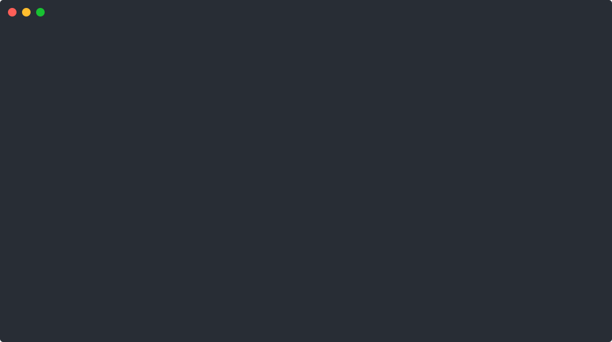

<h1 align="center">
    terminal.
</h1>
<p align="center">
    what I need to use that terminal thing
</p>
<p align="center">
    
</p>

# Install

```shell
./script/bootstrap
```

OS Agnostic - Just needs:

* git
* zsh
* One [NerdFont](https://www.nerdfonts.com) ( e.g [JetBrainsMono](https://github.com/ryanoasis/nerd-fonts/releases/download/v3.3.0/JetBrainsMono.zip) )
